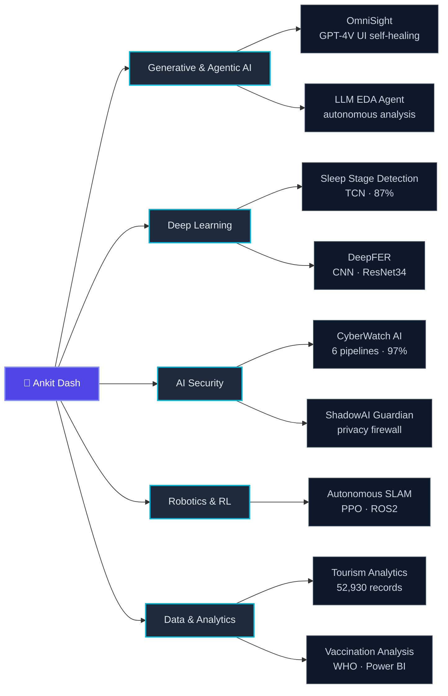

<div align="center">


<a href="https://linkedin.com/in/ankitdash05">
  
</a>

<br/>

<a href="https://linkedin.com/in/ankitdash05"></a>
<a href="mailto:ankit05dash@gmail.com"></a>
<a href="https://ankit-builds1.github.io"></a>
<a href="https://github.com/Ankit-builds1?tab=followers"></a>


<br/>


</div>


## 🧭 &nbsp;About Me

```python
class AnkitDash:
    def __init__(self):
        self.roles    = ["AI/ML Engineer Intern @ Labmentix",
                         "Gen AI Intern @ Infotact Solutions"]
        self.location = "Cuttack, Odisha, India"
        self.studies  = "Data Analytics & Machine Learning (final year)"
        self.building = ["generative & agentic AI systems",
                         "local-first AI security tools",
                         "reinforcement learning for robotics"]
        self.learning = ["MLOps", "deployment", "multi-agent orchestration"]

    def philosophy(self) -> str:
        return "Ship models that run in the real world — documented and reproducible."
```

> 💼 &nbsp;**Open to full-time roles and internships** — Gen AI / Agentic AI, AI-ML Engineer, Data Scientist and Data Analyst.


## 🗺️ &nbsp;How My Work Fits Together




## 🧰 &nbsp;Tech Arsenal

<div align="center">

**Languages**


**Machine Learning &amp; Deep Learning**


**Generative &amp; Agentic AI**


<br/>


**Data &amp; Tooling**


</div>


## 🚀 &nbsp;Featured Work

<table>
<tr>
<td width="50%" valign="top">

### 🛡️ [CyberWatch AI](https://github.com/Ankit-builds1/Cyberwatch_ai)

Terminal-first cybercrime detection with **6 ML pipelines** — phishing, malware and intrusion detection. Runs **100% locally**.

`97% accuracy` · Python · Scikit-learn · Docker

 

</td>
<td width="50%" valign="top">

### 🤖 [Autonomous SLAM Robot](https://github.com/Ankit-builds1/autonomous-exploration-learned-slam)

A PPO policy replaces the hand-coded frontier heuristic for robot exploration.

`10.7% faster` `21.9% shorter paths` · ROS2 · Nav2 · Gazebo

 

</td>
</tr>
<tr>
<td width="50%" valign="top">

### 😴 [Sleep Stage Detection](https://github.com/Ankit-builds1/sleep-quality-stage-detection)

Wake/NREM/REM classification from physiological signals, with LLM-generated clinical reports.

`87% accuracy · SHHS` · TCN · PyTorch · Mistral 7B

 

</td>
<td width="50%" valign="top">

### 🔐 [ShadowAI Guardian](https://github.com/Ankit-builds1/shadowai-guardian)

Local-first privacy firewall — scans prompts, repos and Git changes for secrets before they leave your machine.

Python · CLI · Docker

 

</td>
</tr>
<tr>
<td width="50%" valign="top">

### 👁️ [OmniSight](https://github.com/Ankit-builds1/omnisight)

Detects visual UI bugs with a vision-language model and auto-generates PR fixes.

GPT-4V · RPA · Python

 

</td>
<td width="50%" valign="top">

### 🧠 [LLM EDA Agent](https://github.com/Ankit-builds1/llm-eda-agent)

Automated exploratory data analysis driven end-to-end by an LLM agent.

Python · NVIDIA API

 

</td>
</tr>
</table>

<details>
<summary><b>📂 &nbsp;More projects</b></summary>

<br/>

| Project | What it does | Tech |
|---|---|---|
| [**Tourism Analytics**](https://github.com/Ankit-builds1/tourism-experience-analytics) | Regression, classification and recommendations over 52,930 transactions — with leakage-free encoding | Python, XGBoost |
| [**DeepFER**](https://github.com/Ankit-builds1/DeepFER-Facial-Emotion-Recognition) | Facial emotion recognition using a custom CNN and ResNet34 transfer learning | PyTorch, FER2013 |
| [**Flipkart Satisfaction Prediction**](https://github.com/Ankit-builds1/flipkart-customer-satisfaction-prediction) | End-to-end ML capstone — EDA, NLP, Logistic Regression, Random Forest, SVM | Python, NLP |
| [**Vaccination Data Analysis**](https://github.com/Ankit-builds1/vaccination-data-analysis) | WHO immunization data (1980–2023) — EDA, normalized MySQL database, Power BI dashboards | Python, MySQL, Power BI |
| [**Agentic Malware Classification**](https://github.com/Ankit-builds1/hierarchical-agentic-malware-classification) | Hierarchical agentic approach to malware family classification | Python, ML |
| [**TDA Data Science Internship**](https://github.com/Ankit-builds1/TDA-DataScience-Internship) | Weekly submissions covering Python, Pandas, ML and data visualization | Python, Pandas |

</details>


## ⚡ &nbsp;Recent Activity

<!--START_SECTION:activity-->
<!--END_SECTION:activity-->

<sub>↑ This list rewrites itself every 6 hours from my public GitHub events.</sub>


## 💼 &nbsp;Experience &amp; Education

<table>
<tr>
<td width="50%" valign="top">

**🏢 AI/ML Engineer Intern** — *Labmentix*

Building ML pipelines and data analytics projects, including WHO vaccination analysis with Power BI dashboards.

**🏢 GENERATIVE AI Intern** — *Infotact Solutions*

Developed OmniSight, a multimodal UI self-healing and RPA agent using vision-language models.

</td>
<td width="50%" valign="top">

**🎓 B.Tech CSE — Data Analytics &amp; Machine Learning**

*Final year · Odisha, India*

**🌱 Currently learning**

MLOps · Deployment · Agentic AI systems

</td>
</tr>
</table>


## 📊 &nbsp;GitHub Analytics

<div align="center">


<br/>


</div>

### 🧊 &nbsp;My year in 3D

<div align="center">


</div>

### 🐍 &nbsp;Watch the snake eat my contributions

<div align="center">

<picture>
  <source media="(prefers-color-scheme: dark)" srcset="https://raw.githubusercontent.com/Ankit-builds1/Ankit-builds1/output/snake-dark.svg" />
  <source media="(prefers-color-scheme: light)" srcset="https://raw.githubusercontent.com/Ankit-builds1/Ankit-builds1/output/snake.svg" />
  
</picture>

</div>


<details>
<summary><b>🥚 &nbsp;You scrolled this far — here's something for you</b></summary>

<br/>

<div align="center">


</div>

**A few things the repos don't say:**

- 🧪 &nbsp;I benchmark before I optimize — every accuracy number in this README came from a held-out test set, not a training curve.
- 🔒 &nbsp;Two of my projects run entirely offline by design. If a tool needs to phone home to work, I want to know why.
- 🤖 &nbsp;My favourite bug so far: a SLAM robot that learned to spin in place because rotating technically counted as "exploring."
- ☕ &nbsp;Debugging ritual — read the stack trace twice, then rubber-duck it out loud. Works more often than it should.

</details>


## 🤝 &nbsp;Let's Build Something

<div align="center">

Always open to collaborating on **generative AI, agentic systems and applied ML** projects.

<a href="https://linkedin.com/in/ankitdash05"></a>
<a href="mailto:ankit05dash@gmail.com"></a>

<br/><br/>


<br/>

<sub>⭐ Thanks for stopping by — feel free to explore my repos and reach out.</sub>


</div>
