<div align="center">



<br>

<a href="https://ankit-builds1-github-io.vercel.app"></a>
<a href="https://linkedin.com/in/ankitdash-edu"></a>
<a href="mailto:005ankitdash@gmail.com"></a>
<a href="https://github.com/Ankit-builds1?tab=repositories"></a>


</div>



<div align="center">



</div>


## 🧠 About


Final-year **Data Analytics & Machine Learning** student from **Odisha, India 🇮🇳**, currently an **AI/ML Engineer Intern at Labmentix**.

I build machine-learning and cybersecurity systems that leave the notebook — local AI privacy tooling, Docker-first security CLIs, and deep-learning pipelines for healthcare signals. My bias is toward things people can clone, run, and verify for themselves.

I care as much about **what a model doesn't do** as what it does. Every number I publish sits next to its baseline.

```python
class AnkitDash:
    role     = "AI/ML Engineer Intern @ Labmentix"
    identity = "AI/ML + Cybersecurity Engineer"
    focus    = ["Applied ML", "Deep Learning", "Local-First AI", "Cybersecurity"]
    building = "Reliable AI systems with real interfaces"
    open_to  = ["AI/ML roles", "Security projects", "Collaboration"]

    def approach(self) -> str:
        return "Learn deeply. Build clearly. Verify everything."
```

<br clear="right"/>


## 📈 Shipped, Measured

<div align="center">



</div>


## 🚀 Featured Work

<table>
<tr>
<td width="50%" valign="top">

<a href="https://github.com/Ankit-builds1/shadowai-guardian"></a>

### 🛡️ [ShadowAI Guardian](https://github.com/Ankit-builds1/shadowai-guardian)

A local-first AI privacy firewall. Scans prompts, repositories, watched folders and outgoing Git changes **before** secrets or sensitive data ever leave the machine.

`Local-First` · `Docker CLI` · `Secret Leak Guard`

</td>
<td width="50%" valign="top">

<a href="https://github.com/Ankit-builds1/Cyberwatch_ai"></a>

### 🔍 [CyberWatch AI](https://github.com/Ankit-builds1/Cyberwatch_ai)

A Docker-first cybersecurity CLI running six ML pipelines — phishing, harmful text, network intrusion, malware families and anomalous traffic — entirely on-device.

`97.14% Accuracy` · `6 Pipelines` · `100% Local`

</td>
</tr>
<tr>
<td width="50%" valign="top">

<a href="https://github.com/Ankit-builds1/sleep-quality-stage-detection"></a>

### 😴 [Sleep Quality & Stage Detection](https://github.com/Ankit-builds1/sleep-quality-stage-detection)

Temporal Convolutional Network classifying Wake / NREM / REM from physiological signals, paired with Mistral 7B for structured clinical sleep reports.

`87% Validation` · `TCN + Mistral 7B` · `Healthcare AI`

</td>
<td width="50%" valign="top">

<a href="https://github.com/Ankit-builds1/tourism-experience-analytics"></a>

### 🌍 [Tourism Experience Analytics](https://github.com/Ankit-builds1/tourism-experience-analytics)

Regression, classification and recommendation over 52,930 transactions. Notable for what it **rejects**: a leakage bug that drove XGBoost to R² = −0.64, and a collaborative filter that scored at chance.

`+22 pts vs Baseline` · `Leakage-Free Encoding` · `CI Verified`

</td>
</tr>
</table>

<details>
<summary><b>🔬 How I approach a modelling problem</b> — click to expand</summary>

<br>

| Step | What I actually do |
|---|---|
| **1. Baseline first** | Before any model, compute the trivial predictor — majority class, train mean, random ranking. Every later number gets reported against it. |
| **2. Measure the ceiling** | Decompose the variance. If a perfect model can only reach R² = 0.26, an R² of 0.14 is 56% of the achievable signal, not a failure. |
| **3. Assume leakage** | Target encodings leak in subtle ways. Leave-one-out is `(S − r)/(n − 1)` — a decreasing function of the row's own target. I check train/test correlation signs automatically. |
| **4. Converge, then stop** | When six independent model families land within one point of each other, that's an *information* limit. More tuning is wasted effort. |
| **5. Report the failures** | A model built, evaluated and rejected with a diagnosis is worth more than a clean list of scores. |

</details>


## 🛠️ Stack

<table>
<tr>
<td width="52%" align="center">



</td>
<td width="48%" align="center">

**Machine Learning**


**Engineering & Deployment**


**Data**


<br>


</td>
</tr>
</table>


## 📊 Activity

<div align="center">


<br>


<br><br>


<sub>One commit at a time.</sub>

</div>


## ⚡ Keep Building

<div align="center">


<br>

<sub><i>Break limits. Learn faster. Build stronger.</i></sub>

<br><br>


<br>

<b>Open to AI/ML roles, security projects and collaboration.</b>

<br>

<a href="mailto:005ankitdash@gmail.com"></a>

<br><br>

<sub>Every banner, terminal, orbit and metric ring on this page is a hand-written animated SVG in <a href="./assets"><code>/assets</code></a> — no screenshots, no third-party render services.</sub>

</div>
