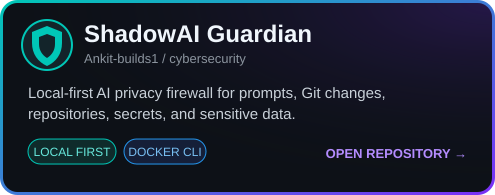
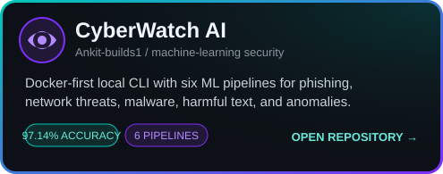
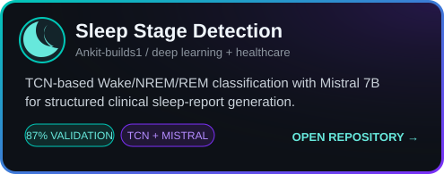

<div align="center">


<br>

<a href="https://ankit-builds1-github-io.vercel.app" target="_blank"></a>
<a href="https://linkedin.com/in/ankitdash-edu" target="_blank"></a>
<a href="mailto:005ankitdash@gmail.com"></a>

<br><br>


</div>

<br>


## 🧠 About Me


I'm a final-year **Data Analytics & Machine Learning** student from **Odisha, India 🇮🇳**, currently working as an **AI/ML Engineer Intern at Labmentix**.

I build practical machine-learning and cybersecurity systems that move beyond notebooks—from local AI privacy tools and Docker-first security CLIs to deep-learning pipelines for healthcare data. I enjoy turning research ideas into tools people can clone, run, test, and understand.

```python
class AnkitDash:
    role = "AI/ML Engineer Intern @ Labmentix"
    identity = "AI/ML + Cybersecurity Engineer"
    focus = [
        "Applied Machine Learning",
        "Deep Learning",
        "Local-First AI",
        "Cybersecurity",
    ]
    currently_building = "Reliable AI systems with real-world interfaces"
    open_to = ["AI/ML opportunities", "Security projects", "Collaboration"]

    def approach(self):
        return "Learn deeply. Build clearly. Verify everything."
```

<br clear="right"/>

<div align="center">


</div>


## 🚀 Featured Projects

<table>
<tr>
<td width="50%" valign="top">

<a href="https://github.com/Ankit-builds1/shadowai-guardian"></a>

### 🛡️ [ShadowAI Guardian](https://github.com/Ankit-builds1/shadowai-guardian)

Local-first AI privacy firewall that scans prompts, repositories, watched folders, and outgoing Git changes before secrets or sensitive data become public.


<br><br>
<a href="https://github.com/Ankit-builds1/shadowai-guardian"></a>

</td>
<td width="50%" valign="top">

<a href="https://github.com/Ankit-builds1/Cyberwatch_ai"></a>

### 🔍 [CyberWatch AI](https://github.com/Ankit-builds1/Cyberwatch_ai)

Docker-first local cybersecurity CLI with six ML pipelines covering phishing, harmful text, network threats, malware families, and anomalous traffic.


<br><br>
<a href="https://github.com/Ankit-builds1/Cyberwatch_ai"></a>

</td>
</tr>
<tr>
<td width="50%" valign="top">

<a href="https://github.com/Ankit-builds1/sleep-quality-stage-detection"></a>

### 😴 [Sleep Quality & Stage Detection](https://github.com/Ankit-builds1/sleep-quality-stage-detection)

TCN-based Wake/NREM/REM classification from physiological signals, paired with Mistral 7B for structured clinical sleep-report generation.


<br><br>
<a href="https://github.com/Ankit-builds1/sleep-quality-stage-detection"></a>

</td>
<td width="50%" valign="middle" align="center">

### Explore More

I keep experimenting with machine learning, data science, security engineering, and practical deployment.

<a href="https://github.com/Ankit-builds1?tab=repositories"></a>

</td>
</tr>
</table>


## ⚡ Keep Building

<div align="center">


<br>

<sub><i>Break limits. Learn faster. Build stronger.</i></sub>

</div>


## 🛠️ Tech Stack

<div align="center">

<br>
<br>


</div>


## 📊 GitHub Stats

<div align="center">

### Contribution Activity


</div>

### 🐍 Contribution Snake

<div align="center">


<sub>One commit at a time.</sub>

</div>


<div align="center">

<i>Build things. Break limits. Learn. Repeat. 🚀</i>


</div>
